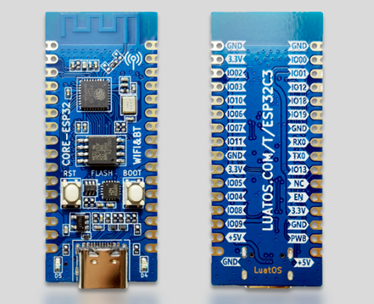
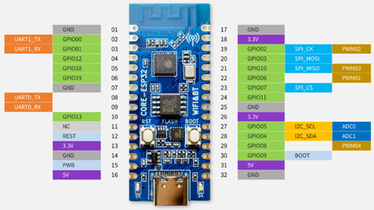

# ESP32-C3 蓝牙功率计模拟器

基于合宙 ESP32-C3 开发板，使用 MicroPython 开发的蓝牙功率计模拟器，可模拟骑行功率、心率和踏频数据。

> 📖 **新用户必读**：请查看 [用户使用手册](docs/user-manual.md) 了解完整使用说明

---

## 📋 目录

- [技术背景](#技术背景)
- [核心功能](#核心功能)
- [技术细节](#技术细节)
- [操作说明](#操作说明)
- [配置参数](#配置参数)
- [注意事项](#注意事项)
- [文件结构](#文件结构)

---

## 🔧 技术背景

### 硬件平台

**开发板**：合宙 CORE ESP32-C3（经典款，CH343 USB 转 TTL）

| 规格 | 参数 |
|------|------|
| 芯片 | ESP32-C3 (RISC-V 单核, 最高 160MHz) |
| 内存 | 384KB ROM + 400KB SRAM（16KB Cache） |
| Flash | 板载 4MB SPI Flash（DIO 模式） |
| 尺寸 | 21mm × 51mm，邮票孔封装 |
| 无线 | WiFi 802.11b/g/n + Bluetooth LE 5.0（共用射频，互斥） |
| USB | Type-C 接口，CH343 USB 转 TTL |
| 天线 | 2.4G PCB 板载天线 |
| LED | D4(GPIO12) + D5(GPIO13)，高电平有效 |
| 按钮 | BOOT(GPIO9) + RESET 各一 |





> **注意**：经典款需安装 [CH343 驱动](http://www.wch.cn/downloads/CH343SER_EXE.html)才能正常下载固件。本项目使用的 GPIO 分配详见 [合宙 ESP32-C3 开发板硬件参考](docs/esp32c3-board-guide.md)。

### 软件环境
- **固件**：MicroPython v1.28
- **蓝牙协议**：Bluetooth Low Energy (BLE)
- **服务标准**：
  - Cycling Power Service (UUID: 0x1818)
  - Heart Rate Service (UUID: 0x180D)

### 蓝牙 GATT 服务结构

| 服务 | UUID | 特征 | 说明 |
|-----|------|-----|------|
| 功率服务 | 0x1818 | 0x2A63 | 瞬时功率 + 曲轴转数数据 |
| 心率服务 | 0x180D | 0x2A37 | 心率测量值 |

---

## ⚡ 核心功能

### 1. 蓝牙功率计模拟
- 模拟骑行功率数据（0-2000W）
- 模拟踏频数据（20-120 RPM）
- 通过曲轴转数和时间戳计算踏频
- 支持蓝牙 NOTIFY 通知模式

### 2. 心率监测模拟
- 模拟心率数据（60-200 BPM）
- 基于功率自动计算心率：`HR = 0.45 × P + 45`
- 平滑心率变化，避免跳变

### 3. WiFi 配置页面
- AP 模式热点：`BikePower`（无密码）
- 固定 IP：`192.168.4.1`
- 网页配置骑行模式、功率、踏频、心率
- 3分钟后自动关闭 WiFi 并重启恢复蓝牙
- 倒计时实时刷新（JS 每秒轮询 `/time` 接口）

### 4. 骑行模式引擎
- 固定功率模式：使用表单数值，功率、踏频、心率稳定小幅波动
- 真实路骑模式：使用内置曲线，模拟滑行、巡航、爬坡、冲刺和恢复
- 间歇训练模式：使用内置曲线，按 60 秒高强度 + 120 秒恢复周期切换
- 随机巡航模式：使用内置曲线，在 110-300W 内自然随机游走

### 5. 按钮控制
- 短按 BOOT 按钮（GPIO9，<300ms）：功率 -10W
- 中按 BOOT 按钮（GPIO9，300ms~2s）：功率 +10W
- 长按 BOOT 按钮（GPIO9，≥2s）：LED 快闪 3 秒等待二次确认
- 确认窗口内再按一次：进入 WiFi 配网模式（关闭蓝牙）
- 确认窗口超时：取消，恢复正常
- 配置自动保存到文件系统

### 6. LED 状态指示
- 板载 D4 指示灯（GPIO12，高电平有效）
- 慢闪（1s 亮/灭）：BLE 广播中，等待连接
- 常亮：BLE 已连接，正常工作
- 快闪（200ms 亮/灭）：等待二次确认进入配网
- 熄灭：WiFi 配网模式，BLE 已关闭

### 7. 蓝牙优先规则
- **蓝牙是核心功能，开机即启动并持续运行**
- 仅在用户二次确认后进入配网模式时才关闭蓝牙
- 长按2秒仅触发确认窗口，不会直接关闭蓝牙
- ESP32-C3 硬件限制：WiFi 与 BLE 共用射频，无法同时运行
- 配网完成或超时后自动重启恢复蓝牙

### 8. OTA 固件更新
- 配网连接家庭 WiFi 后自动检查 GitHub 上的新版本
- 版本清单固定读取稳定入口 `releases/latest/version.json`，避免旧版本设备被历史 tag 固定住
- 发现新版本时配置页面显示绿色更新横幅
- 一键更新：点击「立即更新」→ 逐文件下载 .mpy 字节码 → CRC32 校验 → 原子替换
- 安全回滚：boot.py 启动时 `__import__` 校验 9 个核心模块，失败自动从 .bak 回滚
- 差量更新：仅下载 CRC32 哈希不同的文件，节省流量和时间
- .mpy 字节码托管：mpy-cross 预编译，代码保护 + 下载更小 + 启动更快
- MicroPython 版本校验：version.json 中 mpy_version 与设备不匹配时拒绝更新
- OTA 下载期间暂停 WiFi 关闭计时器（专用超时 300 秒）

---

## 🔬 技术细节

### 内存优化
```python
# 预分配数据缓冲区，避免频繁创建 bytearray 导致内存碎片
self._power_buf = bytearray(8)  # 功率数据缓冲区
self._hr_buf = bytearray(2)     # 心率数据缓冲区
```

### 数据发送间隔
```python
self._min_notify_interval = 1000  # 1000ms 间隔
```
- 控制蓝牙通知频率，避免数据洪泛
- 减少内存分配和 CPU 占用

### 功率数据包结构（8字节）

| 字节 | 内容 | 说明 |
|-----|------|------|
| 0-1 | Flags | 0x0020（包含曲轴转数数据）|
| 2-3 | Power | 瞬时功率（瓦特，小端序）|
| 4-5 | Crank Revolutions | 曲轴总转数（小端序）|
| 6-7 | Crank Time | 上次转数时间（1/1024秒，小端序）|

### 踏频计算原理
客户端通过以下公式计算踏频：
```
Cadence = (Δ转数 × 60 × 1024) / Δ时间(1/1024秒)
```

### WiFi/蓝牙互斥处理
- ESP32-C3 为单天线设计，WiFi 和 BLE 共享射频，**无法同时运行**
- 开机仅启动 BLE，不自动启动 WiFi
- 用户长按2秒触发确认窗口（LED快闪），二次确认后才关闭 BLE 并启动 WiFi AP
- WiFi 启动后 3 分钟自动关闭并重启恢复 BLE
- 提交配置后 5 秒关闭 WiFi 并重启恢复 BLE
- BLE 初始化失败时自动 `machine.reset()` 重启恢复硬件

### 异步 WiFiManager 创建
- BLE 同步启动完成后，通过 `_thread` 异步创建 WiFiManager
- 不阻塞主循环，BLE 数据持续更新
- WiFiManager 仅在用户触发配网时调用 `start()`

---

## 🎮 操作说明

### 首次使用

1. **上传代码到 ESP32-C3**
   ```bash
   # 方法一：一键部署脚本（推荐）
   ./scripts/bikepower.sh deploy          # 部署代码
   ./scripts/bikepower.sh build           # 编译固件
   ./scripts/bikepower.sh scan            # 扫描串口

   # 方法二：手动使用 mpremote
   mpremote connect auto fs :cp -r *.py :
   ```

2. **运行程序**
   ```bash
   # 一键脚本已包含运行，也可手动执行：
   .\scripts\deploy.ps1                   # Windows PowerShell
   ./scripts/bikepower.sh deploy          # 跨平台入口
   ```

3. **连接蓝牙**
   - 在骑行 App（如 Zwift、TrainerRoad）中搜索蓝牙设备
   - 连接名称为 `BikePower` 的设备

### WiFi 配置

1. **进入配网模式**
   - 长按 BOOT 按钮 2 秒以上松开，LED 开始快闪
   - 在 3 秒内再按一次按钮确认
   - 设备仅在确认 BLE 已停用后才启动 WiFi 热点
   - 若 BLE 停用失败，设备不会继续进入配网链路

2. **连接热点**
   - 手机连接 WiFi：`BikePower`（无密码）

3. **打开配置页面**
   - 浏览器访问：`http://192.168.4.1`

4. **设置参数**
   - 功率 (W)：0-2000
   - 踏频 (RPM)：20-120
   - 心率 (BPM)：60-200

5. **保存配置**
   - 点击「保存」按钮
   - 页面显示 5 秒倒计时后自动关闭
   - 设备重启恢复蓝牙

### 按钮操作

| 操作 | 按住时长 | 功能 |
|------|---------|------|
| 短按 | < 300ms | 功率 -10W |
| 中按 | 300ms ~ 2s | 功率 +10W |
| 长按 | ≥ 2s | LED 快闪 3 秒，等待二次确认 |
| 确认 | 确认窗口内再按一次 | 进入 WiFi 配网模式（关闭蓝牙） |

### OTA 固件更新

1. **进入配网模式**（同 WiFi 配置步骤 1-3）
2. **连接家庭 WiFi**
   - 在配置页面点击「一键配网」
   - 选择家庭 WiFi 并输入密码
3. **检查更新**
   - 连接成功后设备自动检查 GitHub 上的新版本
   - 配置页面显示更新状态横幅
4. **执行更新**
   - 如有新版本，点击「立即更新」
   - 页面显示下载进度（文件数/百分比）
   - 更新完成后设备自动重启
5. **异常处理**
   - 下载失败：页面显示错误信息，可点击「重试」
   - 更新后无法启动：boot.py 自动从 .bak 回滚到旧版本

---

## ⚙️ 配置参数

### 默认值
| 参数 | 默认值 | 范围 |
|-----|-------|------|
| 功率 | 200W | 0-2000W |
| 踏频 | 90 RPM | 20-120 RPM |
| 心率 | 140 BPM | 60-200 BPM |
| 骑行模式 | 固定功率 | steady/road/interval/random |

### 可调参数（代码中）
```python
BTN_PIN = const(9)                          # BOOT 按钮引脚
LED_PIN = const(12)                         # 板载 D4 LED 引脚
SHORT_PRESS_MS = const(300)                 # 短按判定阈值（毫秒）
WIFI_BTN_HOLD_MS = const(2000)              # 进入配网模式长按阈值（毫秒）
CONFIRM_WINDOW_MS = const(3000)             # 二次确认窗口时长（毫秒）
LED_BLINK_SLOW_MS = const(1000)             # LED 慢闪间隔（毫秒）
LED_BLINK_FAST_MS = const(200)              # LED 快闪间隔（毫秒）
BLE_NOTIFY_INTERVAL = const(1000)           # 蓝牙发送间隔（毫秒）
WIFI_SHUTDOWN_MS = const(180_000)           # WiFi 自动关闭时间（毫秒）
FIRMWARE_VERSION = "2.0.2"                  # 固件版本号
MPY_VERSION = "v1.28"                       # MicroPython 版本号
OTA_HTTP_TIMEOUT = const(10)                # OTA HTTP 请求超时（秒）
OTA_DOWNLOAD_CHUNK = const(512)             # OTA 下载缓冲区大小（字节）
```

---

## ⚠️ 注意事项

### 1. WiFi 和蓝牙互斥
- ESP32-C3 的 WiFi 和 BLE 共享射频资源，**无法同时运行**
- 进入配网模式需二次确认（长按2秒→LED快闪→再按一次），才会关闭 BLE 启动 WiFi AP
- 配网完成或超时后设备自动重启恢复 BLE

### 2. 内存限制
- MicroPython 堆内存约 150KB（BLE 启动后约 120KB 可用）
- 避免频繁创建大对象
- 代码已预分配缓冲区优化内存

### 3. 连接稳定性
- 如遇蓝牙频繁断连：
  - 确认 WiFi 已关闭
  - 检查蓝牙发送间隔是否足够（建议 ≥500ms）
  - 避免同时运行多个蓝牙连接

### 4. BLE 硬件异常
- 如 BLE 激活报 `[Errno 5] EIO`，软件重置无法恢复
- 代码已实现自动 `machine.reset()` 重启恢复
- 如重启仍失败，需物理断电重启

### 5. 配置恢复
- 配置保存在文件系统中
- 重启设备后自动恢复上次配置
- 如需清除配置，删除 `power_config.json` 文件

### 6. 页面倒计时
- 配置页面显示 WiFi 剩余关闭时间
- 通过 JS 每秒请求 `/time` 接口实时更新
- 倒计时结束或提交配置后 WiFi 关闭并重启

- WiFi 连接凭据以明文保存在 `wifi_config.txt` 中（SSID + 密码）
- 这是已知限制：ESP32-C3 MicroPython 环境无加密库，且配网场景为短暂开放 AP
- 如需清除已保存的 WiFi 凭据，删除 `wifi_config.txt` 文件

### 8. Web 监控与测试工具

项目提供两个本地浏览器工具页面（位于 `web/` 目录）：

#### 蓝牙数据监控台（`web/monitor.html`）
- 通过 Web Bluetooth API 实时连接 BikePower 设备
- 显示心率、功率、踏频实时数值与趋势图
- 支持日志查看、异常筛选、日志下载
- **使用方式**：在 Chrome/Edge 浏览器中直接打开 `web/monitor.html`
- **浏览器要求**：Chrome 56+、Edge 79+、Opera 43+（Safari/Firefox 不支持 Web Bluetooth）

#### 测试报告页面（`web/test-report.html`）
    └── spec-coding-insights.md — Spec Coding 实践启示
- **使用方式**：在任意浏览器中打开 `web/test-report.html`

---

## 📁 文件结构

```
esp32c3-power/
├── AGENTS.md            — 跨 AI 工具的最小入口规则
├── boot.py              — 硬件初始化（gc/freq）+ OTA 校验回滚 + 部署模式 + 主程序入口
├── app.py               — 主程序，按钮事件循环 + WiFi 触发
├── config.py            — 所有硬编码常量
├── logger.py            — 轻量日志模块
├── utils.py             — 工具函数（安全线程启动）
├── ble_service.py       — BLE 蓝牙功率计模块
├── power_data.py        — 功率数据引擎模块
├── wifi_manager.py      — WiFi 配置管理模块 + OTA 集成
├── web_pages.py         — WiFi 配网页面 HTML 构建 + OTA 更新页面
├── ota_updater.py       — OTA 固件更新模块（版本检查/下载/校验/回滚）
├── images/              — 硬件图片资源
│   ├── esp32c3-front.jpg    — 开发板正面实拍
│   ├── esp32c3-board.jpg    — 开发板侧面视图
│   ├── esp32c3-pinout.jpg   — 引脚功能分布图
│   ├── page1_home.png       — 网页配网首页截图
│   ├── page2_wifi_scan.png  — WiFi扫描页截图
│   ├── page3_config.png     — 参数配置页截图
│   ├── page4_update_available.png — 更新提示页截图
│   ├── page5_success.png    — 保存成功页截图
│   └── page6_update_progress.png — 固件更新页截图
├── specs/               — 模块行为规格（GIVEN/WHEN/THEN）
│   ├── ble-service.md       — BLE 服务规格
│   ├── power-engine.md      — 功率引擎规格
│   ├── wifi-manager.md      — WiFi 管理器规格
│   ├── ota-updater.md       — OTA 更新器规格
│   └── button-handler.md    — 按钮处理规格
├── changes/             — 变更工作区（复杂功能先规划再实现）
├── .trae/rules/         — AI 规则（约束层+示范层+质疑规则）
├── releases/
│   ├── latest/version.json — OTA 当前版本清单
│   └── ota/vX.Y.Z/         — OTA 字节码发布目录
├── target/              — 本地固件产物（忽略入库，自动保留最新 3 个时间戳固件）
├── README.md            — 项目说明文档
├── CHANGELOG.md          — 版本变更记录 + 测试报告
├── scripts/
│   ├── deploy.sh        — 一键部署脚本（macOS/Linux）
│   ├── deploy.ps1       — 一键部署脚本（Windows）
│   ├── common.sh        — 跨平台公共函数库（OS检测+串口扫描）
│   ├── bikepower.sh     — 跨平台统一入口脚本
│   ├── build_firmware.sh — 固件编译脚本
│   ├── flash_firmware.sh — 固件烧录脚本
│   ├── manifest.py      — MicroPython 冻结模块清单
│   ├── gen_version_json.py — OTA 发版脚本（mpy-cross 编译 + version.json 生成）
│   ├── create_github_release.py — GitHub Release 创建与附件上传脚本
│   ├── entropy_scan.py  — Entropy 治理自动化扫描脚本
│   └── capture_screenshots.py — 网页截图辅助脚本
├── test/
│   ├── mock_server.py   — 本地 Mock 测试服务器
│   ├── test_utils.py    — 测试工具函数（emit 输出格式化）
│   ├── test_ble.py      — BLE 测试脚本
│   ├── test_wifi.py     — WiFi 测试脚本
│   └── test_runner.sh   — 测试运行脚本
├── web/
│   ├── monitor.html     — 蓝牙数据监控台（Web Bluetooth，Chrome/Edge 打开）
│   ├── test-report.html — 测试报告页面（部署验证结果展示）
│   ├── ota-update-mockup.html — OTA 更新页面视觉稿
│   ├── config-preview.html — 本地网页配置预览
│   ├── screenshot_tool.html — 网页截图生成工具
│   └── screenshots.html — 手机框架展示页面
└── docs/
    ├── README.md             — 文档分类目录与维护规则
    ├── learning-path.md      — 课程学习路线
    ├── html/                 — Markdown 文档的课程讲义版 HTML
    ├── firmware-build.md    — 固件编译打包指南
    ├── robot-deploy.md      — AI 自动部署指南
    ├── esp32c3-optimization.md — ESP32-C3 优化技巧
    ├── esp32c3-board-guide.md — 合宙 ESP32-C3 开发板硬件参考
    ├── user-manual.md       — 📖 用户使用手册（必读）
    ├── open-source-references.md — 相关开源项目参考
    ├── spec-coding-insights.md — Spec Coding 实践启示
    ├── agent-governance.md — AI Agent 记忆、规则、测试、提交和复盘治理规范
    ├── ota-update-design.md — OTA 固件更新方案设计文档
    ├── release-template.md  — 标准发版模板（CHANGELOG + Release 填空版）
    └── sales-listing.md     — 闲鱼商品发布文案与规则参考
```

---

## 🔗 相关链接

- [MicroPython 官方文档](https://docs.micropython.org/)
- [蓝牙 Cycling Power Service 规范](https://www.bluetooth.com/specifications/gatt/services/)
- [ESP32-C3 技术手册](https://www.espressif.com/)

---

## 📝 更新日志

详见 [CHANGELOG.md](CHANGELOG.md)
