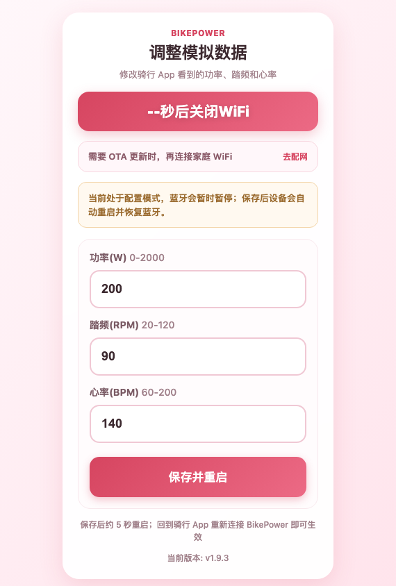
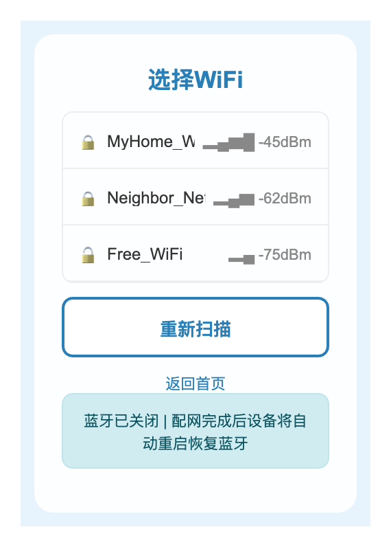
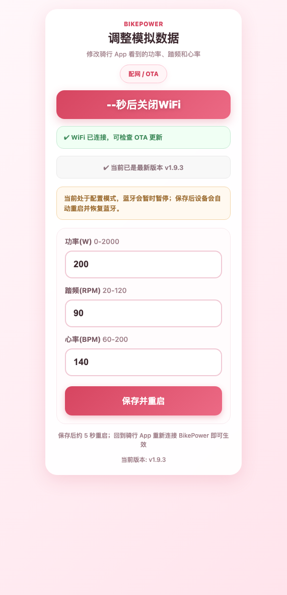
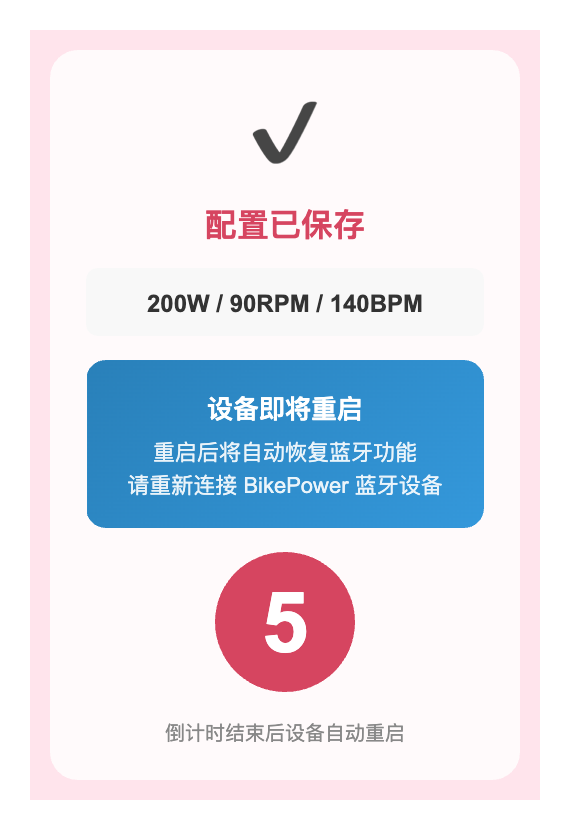
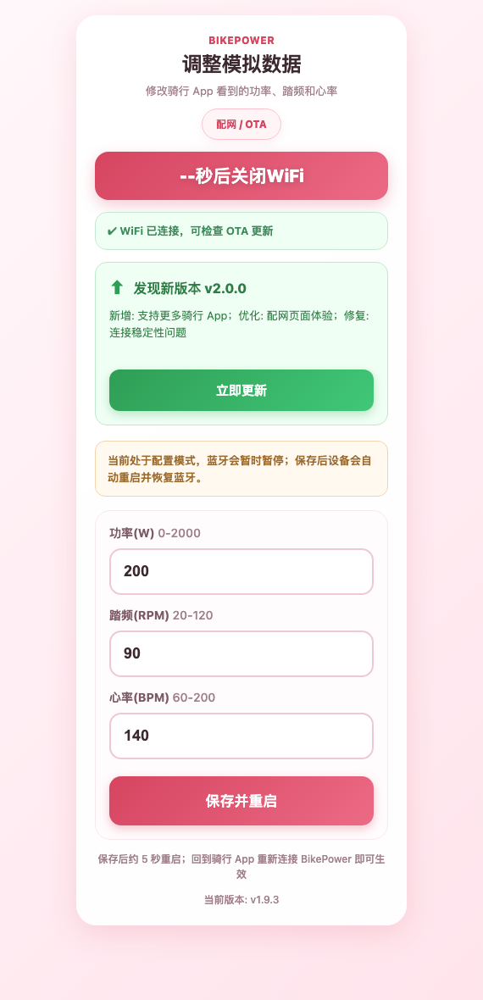
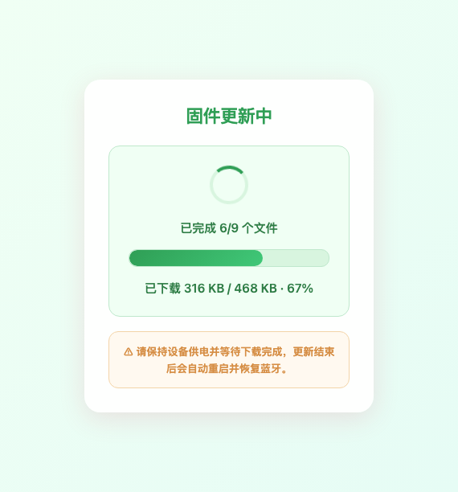

# BikePower 用户使用手册

> 适用设备：合宙 CORE ESP32-C3 蓝牙功率计模拟器  
> 适用固件：v2.0.0+  
> 适用人群：骑行软件用户、测试人员、开发调试人员

## 1. 产品简介

BikePower 是一个基于 ESP32-C3 的蓝牙功率计模拟器，可向骑行 App 模拟输出功率、踏频和心率数据。它适合室内骑行训练、骑行软件联调、BLE 功率计协议学习和演示。

| 能力 | 说明 |
|------|------|
| 蓝牙功率计 | 模拟 Cycling Power Service，输出 0-2000W 功率数据 |
| 心率模拟 | 模拟 Heart Rate Service，输出 60-200 BPM 心率数据 |
| 踏频模拟 | 通过曲轴转数和时间戳模拟 20-120 RPM 踏频 |
| 按钮控制 | 短按降低功率，中按提高功率，长按进入配网确认 |
| WiFi 配网 | 通过手机浏览器配置骑行模式、功率、踏频、心率和家庭 WiFi |
| OTA 更新 | 配网后在线检查版本，下载差异文件并自动回滚保护 |
| LED 指示 | 用 D4 LED 显示广播、连接、确认、配网和 OTA 状态 |

> 注意：本设备输出的是模拟数据，不是实测功率，不能替代真实功率计用于正式训练评估或比赛数据记录。

### 1.1 第一次使用检查清单

| 步骤 | 检查项 | 正常现象 |
|------|--------|----------|
| 供电 | Type-C 线缆连接稳定 | D4 LED 开始慢闪 |
| 蓝牙 | 骑行 App 搜索传感器 | 看到 `BikePower` |
| 连接 | 选择功率计服务 | D4 LED 常亮 |
| 数据 | 进入骑行页面 | 显示功率、踏频和心率 |
| 调节 | 短按或中按 BOOT | 功率每次变化 10W |

如果某一步不符合预期，请先按 RESET 重启，再参考第 7 节常见问题排查。

## 2. 硬件说明

### 2.1 开发板外观

### 2.2 引脚参考

| 硬件 | 项目使用 | 说明 |
|------|----------|------|
| BOOT 按钮 | GPIO9 | 调节功率、进入配网确认窗口 |
| D4 LED | GPIO12 | 状态指示灯，高电平点亮 |
| Type-C | 供电/烧录 | 推荐使用 Type-C 供电 |
| RESET | 重启设备 | 异常时可手动重启 |

### 2.3 供电注意事项

- 推荐使用 Type-C USB 供电。
- 如通过排针供电，请确认电压和接线正确。
- 所有 GPIO 都是 3.3V 电平，不能直接接入 5V 信号。

## 3. 快速开始

### 3.1 上电

1. 使用 Type-C 数据线连接开发板和电脑、充电器或移动电源。
2. 等待 D4 LED 慢闪，表示设备正在蓝牙广播。
3. 如果 LED 不亮或没有状态变化，按一下 RESET 重启。

### 3.2 连接骑行 App

1. 打开手机、电脑或骑行设备上的蓝牙。
2. 打开 Zwift、TrainerRoad、Onelap、GoldenCheetah 等骑行软件。
3. 在设备配对页面搜索 `BikePower`。
4. 连接功率计服务，按需连接心率服务。
5. D4 LED 常亮后，表示已有蓝牙连接。

不同 App 的入口名称可能不同，通常位于“传感器”“设备配对”“功率计”或“心率带”页面。不要在系统蓝牙设置里长期绑定设备，优先在骑行 App 内搜索并连接。

### 3.3 调节模拟功率

| 操作 | 按住时长 | 功能 |
|------|----------|------|
| 短按 | 小于 300ms | 功率 -10W |
| 中按 | 300ms 到 2s | 功率 +10W |
| 长按 | 大于等于 2s | 进入配网确认窗口，LED 快闪 |
| 确认 | 快闪窗口内再按一次 | 关闭蓝牙并启动 WiFi 配网 |

## 4. LED 状态说明

| 状态 | LED 行为 | 含义 |
|------|----------|------|
| 蓝牙广播 | 慢闪，约 1 秒亮灭 | 等待骑行 App 连接 |
| 蓝牙已连接 | 常亮 | 蓝牙连接正常 |
| 配网确认 | 快闪，约 200ms 亮灭 | 等待二次确认进入 WiFi 配网 |
| WiFi 配网 | 熄灭 | 蓝牙已关闭，WiFi 热点已启动 |
| OTA 下载 | 双闪 | 正在下载固件，请勿断电 |

> ESP32-C3 上 WiFi 和 BLE 共用射频，本项目采用互斥模式。进入 WiFi 配网时会关闭蓝牙，配网完成或超时后设备会重启恢复蓝牙。

如果 LED 状态和当前操作不一致，优先按 RESET 重启。BLE 硬件异常时，软件重启不一定能完全恢复，必要时请断电 5 秒后再上电。

## 5. WiFi 配网与参数配置

### 5.1 进入配网模式

1. 长按 BOOT 按钮 2 秒以上后松开。
2. D4 LED 快闪，表示进入二次确认窗口。
3. 在确认窗口内再按一次 BOOT。
4. 设备关闭蓝牙并启动 `BikePower` WiFi 热点。
5. 手机或电脑连接 `BikePower` 热点。
6. 浏览器访问 `http://192.168.4.1`。

> 安全提醒：`BikePower` 热点默认无密码，仅用于短时间配网。请在可信环境中操作，配网完成或 180 秒超时后设备会自动关闭 WiFi 并重启。

### 5.2 首页配置表单

打开 `http://192.168.4.1` 后会直接进入配置表单，这是最常用的主流程。

| 区域 | 作用 |
|------|------|
| 骑行模式选择 | 选择固定功率、真实路骑、间歇训练或随机巡航 |
| 功率、踏频、心率表单 | 设置不同模式的基础模拟数据 |
| 配网 / OTA | 右上角辅助入口，仅在需要 OTA 或保存家庭 WiFi 时使用 |
| 倒计时 | 提醒当前配置窗口剩余时间，超时后设备自动重启恢复蓝牙 |

### 5.3 选择家庭 WiFi

WiFi 扫描页会显示附近网络、信号强度和加密状态。建议选择信号强、稳定的 2.4GHz 网络。

| 显示项 | 说明 |
|--------|------|
| 锁图标 | 表示网络是否需要密码 |
| dBm | 信号强度，数值越接近 0 信号越强 |
| 重新扫描 | 刷新附近 WiFi 列表 |

### 5.4 配置骑行模式、功率、踏频和心率

| 参数 | 范围 | 默认值 | 说明 |
|------|------|--------|------|
| 骑行模式 | steady/road/interval/random | steady | 数据模拟方式 |
| 功率 | 0-2000W | 200W | 仅固定功率模式可编辑 |
| 踏频 | 20-120 RPM | 90 RPM | 仅固定功率模式可编辑 |
| 心率 | 60-200 BPM | 140 BPM | 仅固定功率模式可编辑 |

| 模式 | 说明 |
|------|------|
| 固定功率 | 使用表单数值，功率、踏频、心率稳定小幅波动 |
| 真实路骑 | 使用内置曲线，滑行 0-15W、巡航 130-220W、爬坡 235-335W、冲刺 385-480W |
| 间歇训练 | 使用内置曲线，60 秒 285-355W 高强度 + 120 秒 85-145W 恢复 |
| 随机巡航 | 使用内置曲线，在 110-300W、65-94RPM 内随机游走 |

配置完成后点击“保存并重启”。设备会写入配置文件，并在约 5 秒后自动重启，重启后恢复蓝牙广播。

只有固定功率模式会使用表单里的功率、踏频和心率。选择真实路骑、间歇训练或随机巡航后，这些输入框会被禁用，设备使用内置计算规则。切换骑行模式后需要保存并重启，回到骑行 App 重新连接 `BikePower` 后生效。

### 5.5 保存成功

保存成功页会显示已保存的参数和重启倒计时。倒计时期间不要断电，等待设备自动恢复蓝牙即可。

## 6. OTA 固件更新

### 6.1 检查更新

设备连接家庭 WiFi 后，会读取稳定版本清单 `releases/latest/version.json`。如果发现新版本，配置页会出现更新提示。

### 6.2 执行更新

1. 确认设备已连接家庭 WiFi。
2. 在更新横幅中点击“立即更新”。
3. 保持设备供电，等待文件下载和校验完成。
4. 下载完成后设备自动重启。
5. 重启后如校验通过，进入新版本；如校验失败，自动回滚旧版本。

### 6.3 OTA 注意事项

- OTA 下载期间请勿断电。
- OTA 下载期间 WiFi 关闭计时器会暂停，下载完成或失败后再继续恢复流程。
- 更新失败时系统会保留 `.bak` 备份并自动回滚。
- 如果多次更新失败，请检查家庭 WiFi、网络访问和版本清单是否可用。
- 如果页面一直停留在下载状态，请等待 1 分钟后刷新；仍无变化时按 RESET 重启并重新检查更新。

## 7. 常见问题

### 7.1 搜索不到 `BikePower`

可能原因和处理方式：

| 原因 | 处理方式 |
|------|----------|
| 设备未上电 | 检查 Type-C 供电，按 RESET 重启 |
| 当前处于 WiFi 配网模式 | 等待超时重启，或手动 RESET |
| 手机蓝牙缓存异常 | 关闭再打开蓝牙，重新搜索 |
| 骑行 App 未扫描功率计 | 在功率计/传感器配对页面重新搜索 |

部分手机会缓存旧蓝牙设备信息。如果反复搜索失败，可以关闭骑行 App、关闭系统蓝牙 10 秒，再重新打开 App 搜索。

### 7.2 蓝牙连接后没有数据

请确认：

- D4 LED 是否常亮。
- 骑行 App 是否连接的是功率计服务，而不是普通蓝牙列表里的设备。
- 当前功率是否大于 0，可通过中按 BOOT 增加功率。
- 如果仍无数据，按 RESET 重启设备后重新连接。

### 7.3 无法打开 `192.168.4.1`

请确认：

- 手机或电脑已连接 `BikePower` 热点。
- 当前 LED 处于熄灭状态，表示设备在 WiFi 配网模式。
- 浏览器地址输入的是 `http://192.168.4.1`，不是 `https://`。
- 若 180 秒超时，设备会自动重启恢复蓝牙，需要重新进入配网。

### 7.4 配置保存后没有生效

请确认：

- 保存后看到“配置已保存”页面。
- 倒计时结束前没有断电。
- 设备重启后重新连接 `BikePower` 蓝牙。
- 参数范围合法，超出范围会被限制到允许区间。

### 7.5 OTA 失败怎么办

| 现象 | 处理方式 |
|------|----------|
| 下载失败 | 检查家庭 WiFi，重新进入配网页面后重试 |
| 版本检查失败 | 确认网络可访问 Gitee Raw 版本清单 |
| 更新后启动异常 | 等待自动回滚，必要时按 RESET 重启 |
| 多次失败 | 使用 USB 重新烧录全量固件 |

### 7.6 什么时候需要 USB 重新烧录

| 场景 | 是否建议烧录 | 说明 |
|------|--------------|------|
| 正常 OTA 失败一次 | 否 | 先重试 OTA，通常是网络问题 |
| OTA 后无法恢复蓝牙 | 是 | 可能文件系统或固件状态异常 |
| 忘记设备配置 | 否 | 重新进入配网覆盖保存即可 |
| 设备完全无响应 | 是 | 先换线和按 RESET，仍无效再烧录 |

## 8. 技术规格

### 8.1 蓝牙规格

| 项目 | 参数 |
|------|------|
| 蓝牙版本 | Bluetooth LE 5.0 |
| 功率服务 | Cycling Power Service，UUID `0x1818` |
| 功率特征 | Cycling Power Measurement，UUID `0x2A63` |
| 心率服务 | Heart Rate Service，UUID `0x180D` |
| 心率特征 | Heart Rate Measurement，UUID `0x2A37` |
| 通知间隔 | 1000ms |
| MTU | 69 字节 |

### 8.2 WiFi 规格

| 项目 | 参数 |
|------|------|
| 模式 | AP 配网模式 |
| 热点名称 | `BikePower` |
| 热点密码 | 无 |
| 配网页面 | `http://192.168.4.1` |
| 配网超时 | 180 秒 |
| OTA 计时 | 下载期间暂停 180 秒配网关闭计时 |
| Socket 限制 | 最多同时 3 个连接 |

### 8.3 数据范围

| 数据 | 范围 | 默认值 |
|------|------|--------|
| 功率 | 0-2000W | 200W |
| 踏频 | 20-120 RPM | 90 RPM |
| 心率 | 60-200 BPM | 140 BPM |
| 骑行模式 | steady/road/interval/random | steady |

## 9. 支持的骑行软件

| 软件 | 平台 | 功率 | 心率 |
|------|------|------|------|
| Zwift | Windows / macOS / iOS / Android | 支持 | 支持 |
| TrainerRoad | Windows / macOS / iOS / Android | 支持 | 支持 |
| Onelap | Windows / macOS / iOS / Android | 支持 | 支持 |
| GoldenCheetah | Windows / macOS / Linux | 支持 | 支持 |
| Wahoo Fitness | iOS / Android | 支持 | 支持 |

## 10. 故障恢复

| 场景 | 建议操作 |
|------|----------|
| 蓝牙异常或报 `[Errno 5] EIO` | 按 RESET 或断电重启 |
| 配网过程中卡住 | 等待超时重启，或按 RESET |
| 配置损坏 | 删除 `power_config.json` 后重启 |
| WiFi 凭据错误 | 重新进入配网并覆盖保存 |
| OTA 多次失败 | 使用 USB 全量烧录固件 |

## 11. 相关资料

- [文档目录](README.md)
- [课程学习路线](learning-path.md)
- [固件编译打包指南](firmware-build.md)
- [OTA 固件更新设计](ota-update-design.md)
- [合宙 ESP32-C3 开发板硬件参考](esp32c3-board-guide.md)

---

**文档版本**：v2.0.0  
**最后更新**：2026-05-22  
**适用固件版本**：v2.0.0+  
**本次更新**：新增骑行模式配置说明，支持固定功率、真实路骑、间歇训练和随机巡航。
